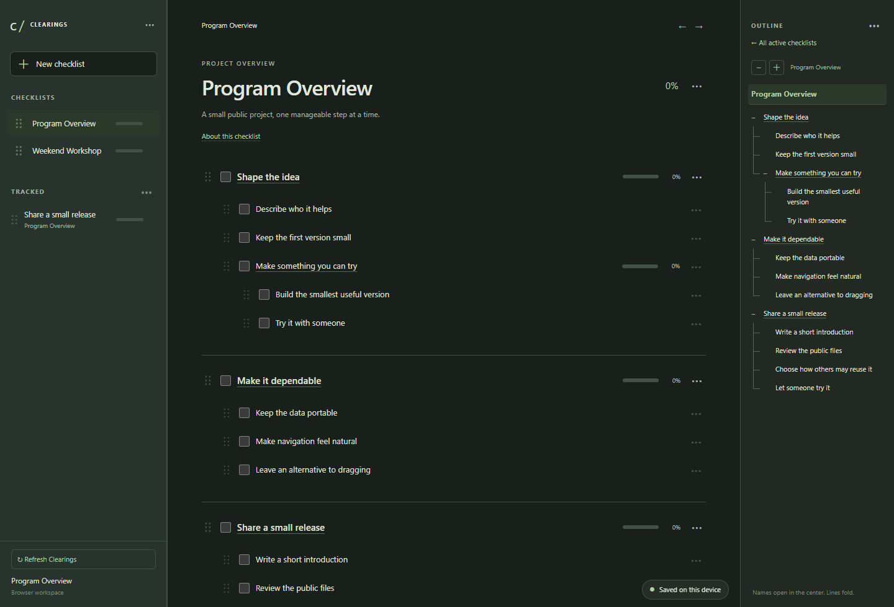

<!-- SPDX-License-Identifier: MPL-2.0 -->
# Clearings 0.4.4

Clearings is a local checklist and outline for people and their AI collaborators.
Your workspace stays on your device. There is no account, telemetry, bundled AI,
API key, subscription or runtime download.

## Download and open

Get the matching file from [Releases](https://github.com/IoriReiMei/clearings/releases).

| Computer | Download | Install |
| --- | --- | --- |
| Windows x64 | `Clearings-Setup-0.4.4-Windows-x64.exe` | Open the installer, choose shortcuts, finish, then open Clearings. No administrator rights or separate Python installation. |
| Mac Apple silicon | `Clearings-0.4.4-macOS-arm64.dmg` | Open the image and drag Clearings into Applications. |
| Mac Intel | `Clearings-0.4.4-macOS-x86_64.dmg` | Open the image and drag Clearings into Applications. |
| Linux x64 | `Clearings-Install-0.4.4-Linux-x64.run` | Run `sh Clearings-Install-0.4.4-Linux-x64.run`, then open Clearings from the app menu. |

The installed app opens your normal browser at `http://127.0.0.1:18765/`.
Windows binaries are unsigned; macOS builds are ad-hoc signed, not notarized.
Your operating system may require an extra launch approval. These builds are
suited to this private review; a seamless public first launch still needs platform
signing. See [verification limits](CLEARINGS_VERIFICATION.md).

The source ZIP also contains `index.html`, usable directly without installing a
runtime. Direct-file and hosted use support JSON import/export; local assistant
handoff requires the installed helper (or Python for the source launcher).

## Windows tray icon

While its helper runs, Clearings has an icon in the Windows notification area (possibly under the hidden-icons arrow). Click it for **Running locally**, **Open Clearings**, and **Stop helper…**. Save browser edits before stopping from the tray. Closing a browser tab leaves the helper and icon running; stopping the helper removes the icon. No launch-at-login task is added. Mac and Linux keep their existing launch behavior.

## Work together

Create a workspace, choose your display name, and add checklists. Click titles
to explore or fold groups; click checkboxes to complete work. Parent closure does
not claim that all its children were completed. Use **Move to…** to move an item
under another heading or back to the overview. The item keeps its identity,
subtasks, checkmark and attribution. Menus, grips and keyboard controls also
reorder siblings. Shared items remain one object wherever linked.

A checked item shows its completer. **Created / completed by…** shows names and
timestamps; Shift reveals additional edit labels. Creator and completer records
survive moves and exports. Missing older history is shown as unknown.

Give your local assistant the [assistant guide](AI_CHECKLIST_GUIDE.md). It can
read, propose and sign task changes; another assistant can read and continue
those changes immediately, even on a newly created checklist. You do not have to
relay them. **Refresh Clearings** brings signed work into your visible browser
copy. Independent edits combine; conflicts stay visible for review. Assistants
still need their ordinary execution environment and user authorization: Clearings
does not launch models or run tasks on its own. Names identify declared authors,
not verified identities.

The workspace menu contains **Settings**, **Preferences**, **Recent actions**,
**Export workspace backup…**, and **Save and quit Clearings**. Templates provide
blank GitHub release and patch checklists; they never publish anything.

## Keep your work

Ordinary changes save to this browser's IndexedDB. The helper keeps a saved local
handoff plus pending signed work. Export a backup regularly. A different browser,
profile, file path or address has separate browser storage: export from the old
location and import once at the new one. Never discard the old copy before
checking the new one. Working edition port 8765 and installed edition port 18765
are deliberately separate. Uninstall removes the program, not your work.

Version 0.4.3 reads older documents. Its optional attribution field requires
0.4.3 or newer when importing a new export into another Clearings copy.

## Development and license

See [local handoff](docs/LOCAL_HANDOFF.md), [installer build notes](packaging/README.md),
[real-browser check](docs/NATIVE_SMOKE_TEST.md), and [hosting](docs/HOSTING.md).
Only reviewed, allowlisted source and fictional examples enter release packages.
The app and designated files use MPL 2.0; see [license](LICENSE),
[scope](LICENSE_SCOPE.md), and [third-party notes](THIRD_PARTY_NOTES.md).
